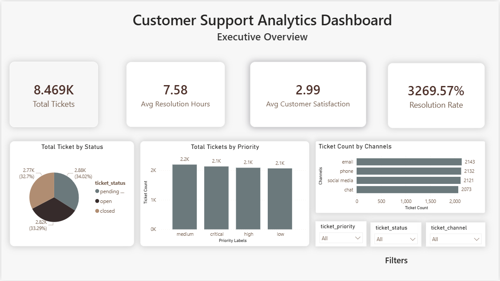
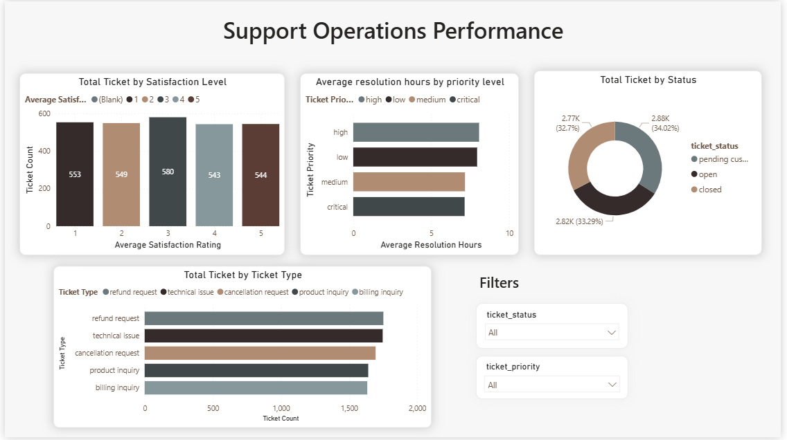
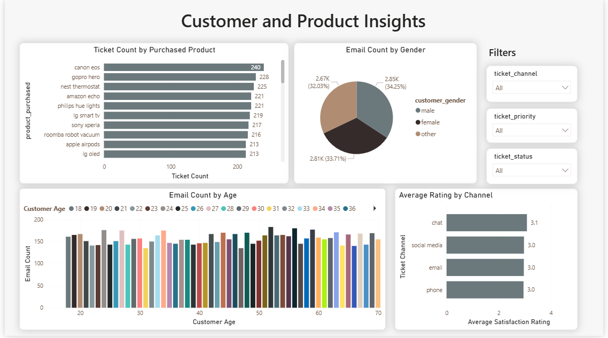
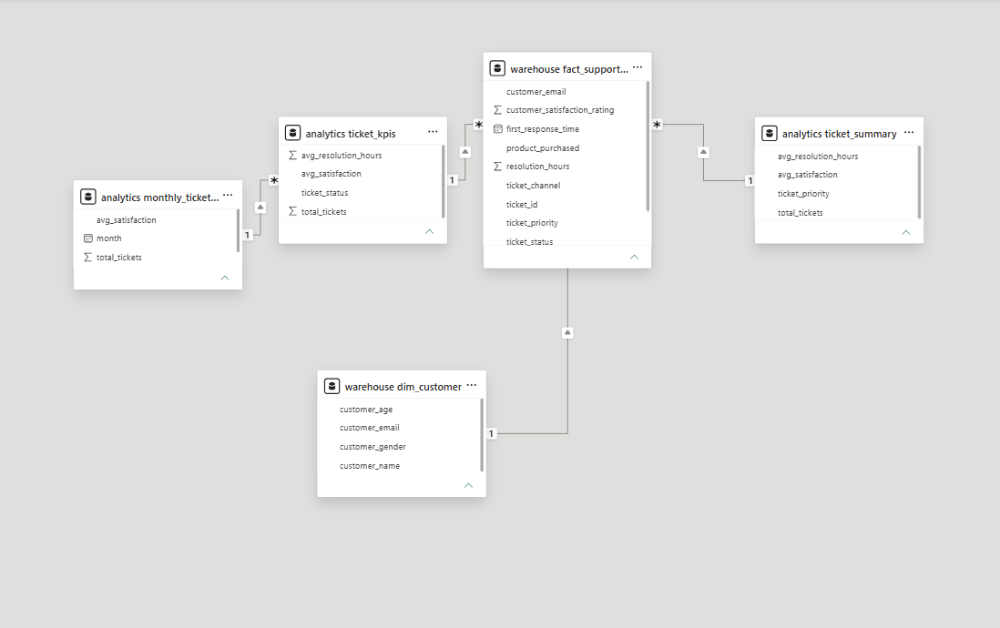

# Customer Support Data Warehouse & Analytics Dashboard

## Project Overview

This project simulates a real-world customer support analytics pipeline using PostgreSQL and Power BI.

The goal of the project was to transform raw customer support ticket data into a structured analytics warehouse capable of supporting operational reporting, KPI tracking, and business intelligence dashboards.

The project demonstrates core data engineering concepts including:
- ETL pipelines
- Data cleaning and transformations
- Star schema modeling
- Fact and dimension tables
- SQL optimization
- KPI engineering
- Interactive Power BI dashboards

---

# Tech Stack

- PostgreSQL
- SQL
- Power BI
- pgAdmin
- CSV Dataset
- GitHub

---

# Data Architecture

```text
CSV Dataset
    ↓
Raw Layer
    ↓
Staging Layer
    ↓
Warehouse Layer
    ↓
Analytics Layer
    ↓
Power BI Dashboard
```

---

# Architecture Diagram

Paste your Mermaid diagram image here later.

Example:


---

# ETL Pipeline

## 1. Raw Layer

Imported raw customer support ticket CSV data into PostgreSQL.

Schema:
```sql
raw.support_tickets
```
Raw CSV files are stored in the `datasets/` folder and a cleaning script is provided at `datasets/clean_dataset.py`.

---

## 2. Staging Layer

Performed:
- datatype standardization
- NULL handling
- data cleaning
- calculated metrics
- timestamp validation

Schema:
```sql
staging.tickets_clean
```

---

## 3. Warehouse Layer

Created star schema warehouse structure with:
- fact tables
- dimension tables

Fact Table:
```sql
warehouse.fact_support_tickets
```

Dimension Tables:
```sql
warehouse.dim_customer
warehouse.dim_product
warehouse.dim_channel
warehouse.dim_priority
warehouse.dim_status
```

---

## 4. Analytics Layer

Created reusable analytics views and KPI aggregations.

Views:
```sql
analytics.ticket_kpis
analytics.ticket_summary
```

---

# Star Schema Design

## Fact Table

### fact_support_tickets

Contains:
- ticket metrics
- operational timestamps
- resolution metrics
- satisfaction ratings

---

## Dimension Tables

### dim_customer
Customer demographic information.

### dim_product
Supported products.

### dim_channel
Support communication channels.

### dim_priority
Ticket priority categories.

### dim_status
Ticket lifecycle statuses.

---

# SQL Features Demonstrated

- Joins
- Aggregations
- CASE statements
- Views
- Materialized Views
- Indexing
- ETL transformations
- Data cleaning
- KPI calculations
- Star schema modeling
- Data quality validation

---

# Data Quality Handling

The dataset contained:
- missing timestamps
- incomplete workflows
- NULL operational states
- inconsistent resolution times

The ETL process included:
- NULL preservation
- invalid metric filtering
- timestamp validation
- resolution hour cleaning

Example:
```sql
UPDATE staging.tickets_clean
SET resolution_hours = NULL
WHERE resolution_hours < 0;
```

---

# KPI Metrics

The dashboard includes:

- Total Tickets
- Resolution Rate
- Average Resolution Hours
- Average Customer Satisfaction
- Ticket Status Distribution
- SLA Performance
- Product Issue Monitoring
- Ticket Priority Analysis

---

# Power BI Dashboard Pages

## 1. Executive Overview

Features:
- KPI cards
- ticket status distribution
- ticket priority analysis
- support channel breakdown

---

## 2. Operational Analytics

Features:
- SLA performance
- ticket type analysis
- satisfaction distribution
- operational metrics

---

## 3. Customer & Product Insights

Features:
- problematic products
- customer demographics
- satisfaction by support channel
- customer analysis

---

# Dashboard Screenshots

## Executive Overview


---

## Operational Analytics


---

## Customer & Product Insights


---

## Data Model


---

# Project Folder Structure

```text
customer-support-data-warehouse/
│
├── sql/
│   ├── analytics/analytics_schema_queries.sql
│   ├── raw/raw_schema_queries.sql
│   ├── staging/staging_schema_queries.sql
│   └── warehouse/warehouse_schema_queries.sql
│
├── powerbi/
│   └── customer_support_dashboard.pbix
│
├── screenshots/
│   ├── Executive Overview page.png
│   ├── Executive Overview page 2.png
│   ├── Customer Insights page.png
│   ├── Operational Analytics page.png
│   └── Model relationships.png
│
├── datasets/
│   ├── customer_support_tickets.csv
│   ├── customer_support_tickets_clean.csv
│   └── clean_dataset.py
│
├── docs/
│   └── architecture_diagram.png
│
└── README.md
```

---

# Business Problem

Customer support teams require visibility into:
- operational performance
- ticket backlogs
- SLA compliance
- customer satisfaction
- product-related support issues

This project demonstrates how a structured analytics warehouse can support data-driven operational decision-making.

---

# Key Learning Outcomes

Through this project, I learned:
- PostgreSQL database management
- ETL pipeline development
- data cleaning workflows
- dimensional modeling
- analytical SQL development
- Power BI dashboard design
- operational KPI engineering
- data warehouse architecture

---

# Resume Description

```text
Built a PostgreSQL-based customer support analytics warehouse with ETL transformations, star schema modeling, KPI engineering, SQL optimization, and interactive Power BI dashboards for operational reporting and SLA analysis.
```

---

# Future Improvements

Potential future enhancements:
- automated ETL scheduling
- Python ETL pipelines
- Airflow orchestration
- cloud warehouse deployment
- real-time dashboard refreshes
- advanced DAX measures

---

# Author

Jones Ivan L. Sevilla

LinkedIn:
https://www.linkedin.com/in/jones-ivan-sevilla-a022333a6/

GitHub:
https://github.com/Prototyp3html